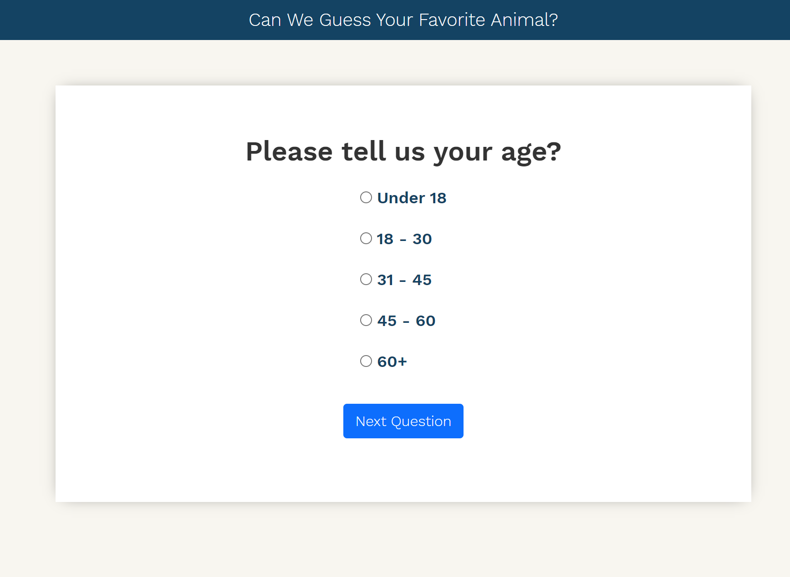

# Survey App

An online survey that will be interacted with the end user via a web application.

## Application Development Environment

HTML  
CSS  
JavaScript  
Angular (v 12.1.3)  
Karma (Test Suite)(v 6.3.4)  
Data Storage/Persistence (localStorage)  
The application was generated with [Angular CLI](https://github.com/angular/angular-cli) version 12.0.1.

## Required Technology Stack

Node & NPM  
Angular CLI (v 12.0.1 <)

## Development server

Open Git Bash/Terminal  
cd to the application root directory  
Run `npm install`  
Run `npm audit` (optional)  
Run `ng serve` for a dev server.  
Navigate to `http://localhost:4200/` on web browser. The app will automatically reload if you change any of the source files.

## Deployment & Build

Run `ng build` to build the project. The build artifacts will be stored in the `dist/` directory and host them on any web server capable of serving files; such as Node.js, Java, .NET, or any backend such as Firebase, Google Cloud, or App Engine. [Read more](https://angular.io/guide/deployment).

## Running unit tests

Run `ng test` to execute the unit tests via [Karma](https://karma-runner.github.io).

## Using build script for running image and container on Docker

Use Dockerfile for creating docker image and container  
We are using nginx server for running the application locally. See `nginx.conf` file for more information  
Steps:  
cd to the application root directory  
Run `ng build` (if it didn't do already) to generate the `dist/` directory and files  
Run `docker build -t survey-app-image .`  
Check and verify new docker image by running `docker image ls`  
Run `docker run --name sur-vey-app-container -d -p 8080:80 survey-app-image`  
Check and verify the container (by it's id) `docker container ls`  
Navigate to the URL `http://localhost:8080/`  
  
    

